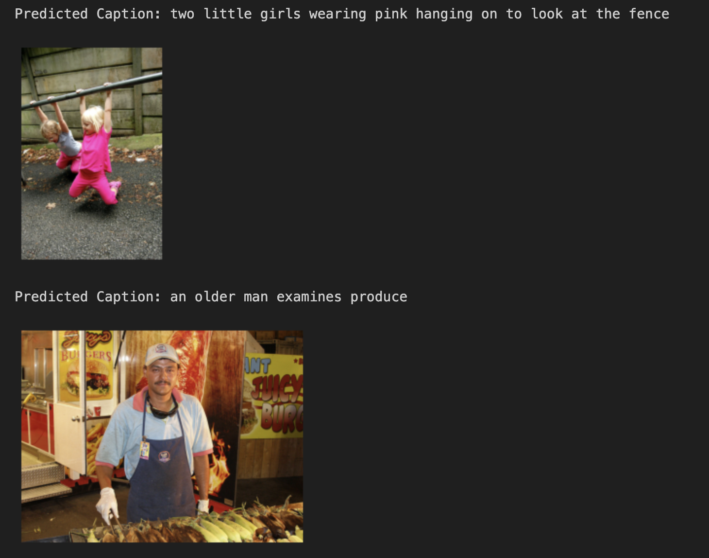
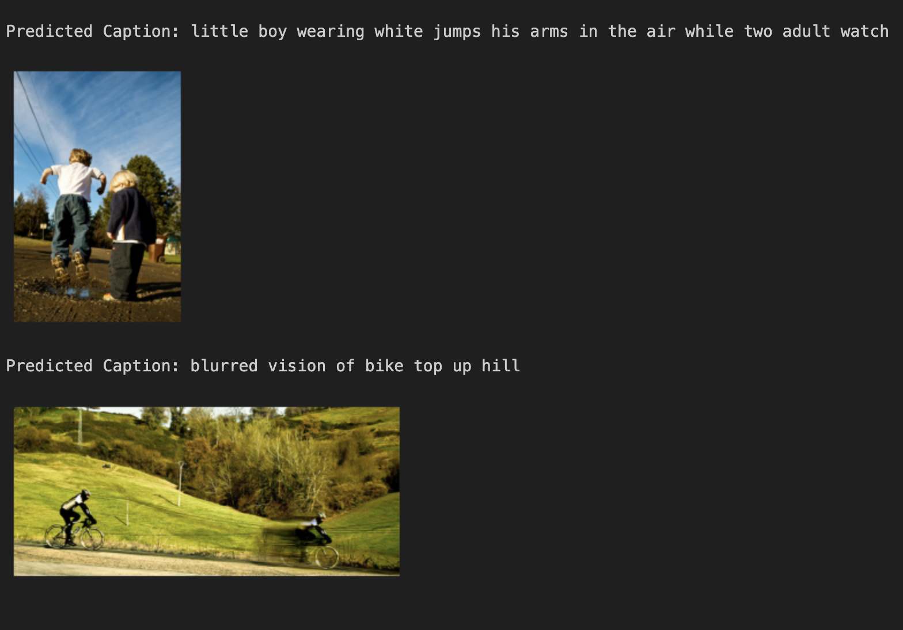

# Caption Generation

Generate image captions using CNN and LSTM. Try also with GRU in place of LSTM.

Make use of a pre-trained model, such as Inception V3 or DenseNet, for generating image embedding to be fed into LSTM/GRU..

Use any of the following three datasets: Flickr_8K, Flickr_30K, and MSCOCO. Keep aside some images for testing.

Evaluate a generated title applying BLEU score and semantic distance between the actual and the predicted titles.

Compare your results with the ones generated by an LLM.

# LSTM generated captions

# GRU generated captions

# Generated Model links:

[Model Folder](https://drive.google.com/drive/u/0/folders/1oMqZzNpqxKlM-dCjsJb7O9BywZGvKCQF)

# Contributions:
-   Amar Nagargoje
-   Rakesh Soni
-   Dhawnil Panchal